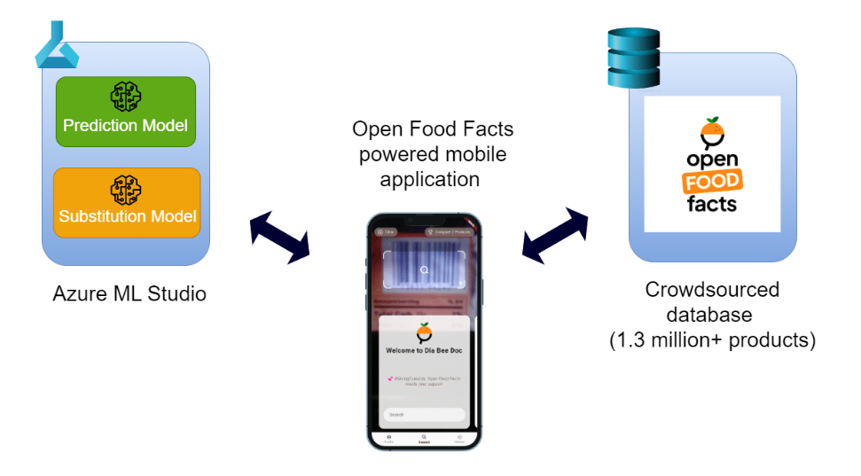
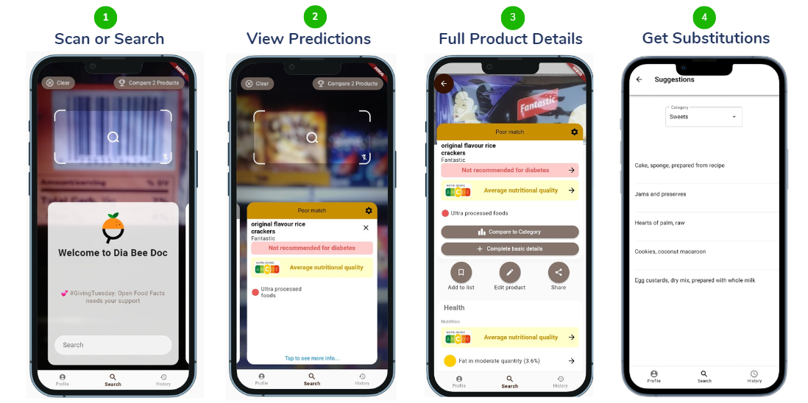
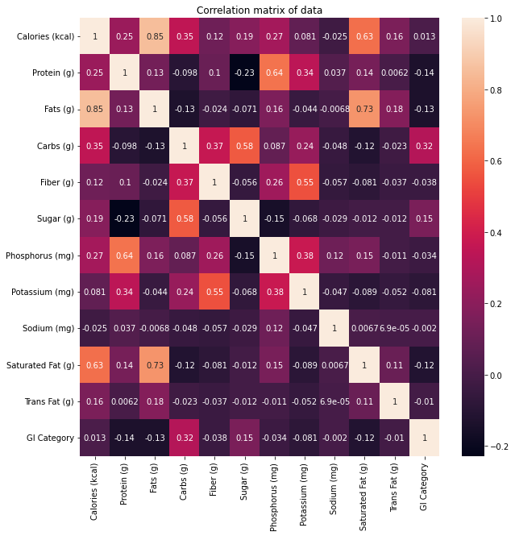
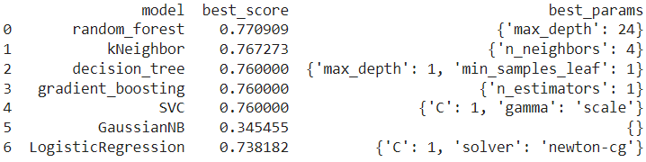
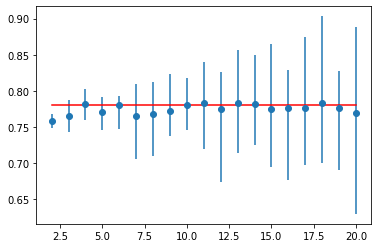
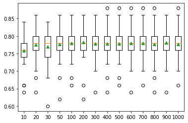
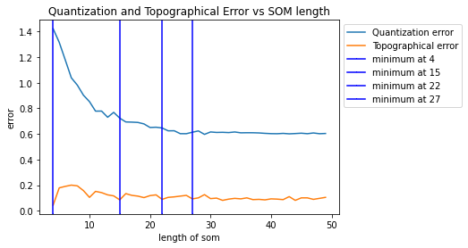

[comment]: # "This is the standard layout for the project, but you can clean this and use your own template"

# Food Recommendation System Using Machine Learning for Diabetic Patients

#### Team

- E/16/083, Dhanushka S.M.V., [email](mailto:e16083@eng.pdn.ac.lk)
- E/16/394, Wijayasinghe S.D.D.D., [email](mailto:e16394@eng.pdn.ac.lk)
- E/16/396, Wijekoon W.M.T.S., [email](mailto:e16396@eng.pdn.ac.lk)

#### Supervisors

- Mr. D.S. Deegalla, [email](mailto:sampath@eng.pdn.ac.lk)
- Mrs. Nadeesha Adikari, [email](mailto:nadeeshaa@eng.pdn.ac.lk)
- Dr. Hashan Amarathunga, [email](mailto:hashansa@gmail.com)

#### Table of content

1. [Abstract](#abstract)
2. [Related works](#related-works)
3. [Methodology](#methodology)
4. [Experiment Setup and Implementation](#experiment-setup-and-implementation)
5. [Results and Analysis](#results-and-analysis)
6. [Conclusion](#conclusion)
7. [Publications](#publications)
8. [Links](#links)

---

## Abstract

Diabetes is a chronic disease that develops when the human body can’t properly process blood sugar. The number of diabetic patients increases each year by millions and only for the year 2021 the health expenditure for diabetes was more than 966 billion USD. Moreover, according to the research, one in ten adults has diabetes and one death per every five seconds worldwide. Even in Sri Lanka, one in five adults has either diabetes or prediabetes. Diabetes can significantly lower life expectancy and negatively affect the quality of life. Therefore, to prevent or postpone health issues, it’s crucial to keep the blood sugar levels within the target range by making healthy food choices.

The Glycemic Index is a rating system for foods and foods with a low Glycemic Index are recommended for diabetic patients. But most of the time the Glycemic Index is not printed on packaged foods and can not find it directly. Therefore, this research project aims to build an intelligent mobile application which is named Diabeedoc. Using Diabeedoc the suitability of a particular food for diabetes can be found in no time. Glycemic Index based machine-learning models are deployed to the Azure cloud. Diabeedoc uses those ML models with the Openfoodfacts database to predict particular food is suitable or not. If it is not suitable Diabeedoc is capable of suggesting better foods using a machine learning based substitution system.

## Related works

Phanich M., Pholkul P., & Phimoltares S. developed a food recommendation system using clustering analysis for diabetes patients. They labeled the food into three groups normal food, limited food, and avoidable food. They created a self-organizing map using 8 nutrient values suggested by domain experts. They trained the system using the K-means clustering algorithm between k from 15 to 20 and found 19 as the best choice. The system recommends 5 foods from both limited and normal food groups that had approximated nutrient content similar to the given food. However, it can not identify a new food that is not in the training data set as avoidable or not.

The study, Personalized Nutrition Recommendation For Diabetic Patients Using Improved K-Means And Krill-Herd Optimization by K.Renuka Devi, J.Bhavithra, Dr.A.Saradha, and others, showed how to combine collaborative filtering and content-based filtering to provide better and more accurate recommendations for diabetic patients. The improved K-means clustering algorithm clustered the patient's profile based on factors such as age, height, blood glucose levels, etc., and the improved Krill-herd algorithm determined how similar the active user query is to other patients. The system's effectiveness was assessed using a variety of metrics, and error values like Fallout rate, Miss rate, and Root Mean Squared Error were found to be the lowest.

In the research, Diet-Right: A Smart Food Recommendation System, they have presented a methodology for a cloud-based meal recommendation system that bases dietary recommendations of users’ pathology data. Most of the current meal recommendation systems employed centralized architecture. Scalability issues arise while dealing with the enormous volume of data, which is the main drawback of employing such systems. To provide scalability and pervasiveness, the proposed system leveraged a cloud-based solution, making the recommendation system easily accessible to users of smartphones. In this system, a user was given access to the whole list of test parameters from which to choose. Additionally, the user entered their gender and age. The user then entered the relevant values from the test report into the parameters they had chosen. In the following stage, these values were transmitted to cloud and compared to the typical ranges that are kept in their database. After calculating the pathological test report abnormality level, the weight assignment and matrix formation process was completed. Following that, each food item’s ranks were determined and arranged in descending order. The user was then given the list of foods that were recommended using an Accountable Care Organizations model. Here, comprehensive experimentation was carried out to evaluate the cost, accuracy, convergence time, and performance improvement when compared with other recommender systems.

## Methodology

This study is based on the “USDA Food Composition Database” given by the U.S. Department of Agriculture. The initial data set contained 51 columns, including 44 nutrient fields and 7 other fields, namely Name, Group, Glycemic index, Insulin index, Serving Size, Acidity (Based on PRAL), and GI Category related to 626 food items. The nutrient content for those 44 nutrient categories was given per 100 grams.
Since the study was based on glycemic index, food items that missed the glycemic index values were dropped from the dataset. And also, the other missing values in columns were replaced by zero.
Then the GI category column values were mapped as,

<ul>
<li>Low : 0</li>
<li>Medium : 1</li>
<li>High : 2</li>
</ul>

According to the suggestions given by the health professional, the 11 most affecting nutrients for diabetics were selected from the dataset along with the corresponding GI category for the next steps. Those nutrients were, ‘Calories’, 'Protein', 'Fats', 'Carbs', 'Fiber', 'Sugar','Phosphorus', 'Potassium', 'Sodium', 'Saturated Fat', 'Trans Fat'. Then the data standardization was done to make sure that the data was internally consistent.

### Prediction System

Initially, the dataset was split such that 80% of the dataset goes into the training set and 20% goes into the testing set. Then the performances of different classification algorithms were analyzed to predict the GI category of the food item. The algorithms used were,

<ul>
<li>Random Forest</li>
<li>K-nearest Neighbors</li>
<li>Decision Tree</li>
<li>Gradient boosting</li>
<li>Support Vector Classifier</li>
<li>Gaussian Naïve Bayes</li>
<li>Logistic regression</li>
</ul>

By considering the size of the dataset, K-fold cross-validation was used with an initial K value of 10. A grid search was also performed for the hyper-parameter optimization.
K value was chosen as 10, but how can we tell if this is the best choice for the dataset? One way to respond to this issue is to conduct a sensitivity analysis for various k values. Therefore, the efficacy was analyzed of the same model using multiple values of K on the same dataset.
Next, the mean classification accuracy obtained from the leave-one-out cross-validation on the same dataset with the mean classification accuracy obtained for various K values was contrasted. A rough approximation for determining how closely a K value reflects the ideal model evaluation test condition is provided by the difference between the scores.
After selecting the suitable K value for the algorithms, hyperparameter tuning was performed separately to choose optimal hyperparameters. Finally, the random forest algorithm was selected as the most suitable algorithm for the prediction system according to the analysis.

### Substitution System

The high glycemic indexed foods were removed from the preprocessed data set to be used for clustering. The following clustering algorithms were used separately to cluster food items.

<ul>
<li>KMeans algorithm</li>
<li>Affinity Propagation</li>
<li>Self-organizing map</li>
</ul>

In order to compare the performance of the algorithms k nearest neighbor algorithm was used as a baseline model. To check the suitability of food for given high GI food, a score function was defined by comparing matching nutrient values in substitutable food. Additionally, the equality between the substitutable food group and the given food group, and the time to produce result were taken to account in compare algorithms.

## Experiment Setup and Implementation

For deploying the machine learning model, first, the model was exported and saved as a PKL file. Then the model was registered in the Azure machine learning portal. And also, a scoring script was created for handling the inputs from the client side and made the API endpoint for the machine learning model.

     
    <i>Figure 01: System Architecture</i>

The mobile application provides a graphical user interface to the project. Let's imagine a scenario of shopping. Firstly, the barcode on the packaged food needs to be scanned. If the product is not available then the product details need to be added with the nutrient values. After that, the suitability of the product for diabetes can be found in the mobile application. Optionally the full product details are available and if the product is not suitable for diabetes, the list of the substitutable foods can be found as well.

     
    <i>Figure 02: Mobile Application</i>

## Results and Analysis

### Prediction System

The below diagram shows correlation between all the possible pairs of values in the dataset. As shown in the figure, a high correlation can be observed between the GI category with nutrients such as Carbs, Sugar, Fats, and Protein.

     
    <i>Figure 03: Correlation matrix of the dataset</i>

The following results were obtained from the initial grid search, which was performed to choose the right set of hyperparameters .

     
    <i>Figure 04: Results in initial grid search</i>

As shown in the image below, a line plot is made to compare the mean accuracy scores to the leave-one-out cross-validation result, with error bars used to show the minimum and maximum values for each result distribution. The results suggest that k=10 alone might be a bit overly optimistic and that k=11 would be a more realistic estimate in Random forest.

     
    <i>Figure 05: Variation of mean accuracy for cross-validation K-values with error bars (Blue) vs. the ideal case (red) in Random forest
</i>

The below plot shows how the classification accuracy varied according to the number of trees in the Random forest. These types of analyses were done for all the algorithms with different hyperparameters to select the most suitable algorithm with optimal hyperparameters.

     
    <i>Figure 06:  Number of trees vs. classification accuracy in Random forest</i>

After all these analyses, the final model gave an accuracy of 0.79.

### Substitution System

The k value was set as 17 due to number of food groups in the dataset. The affinity propagation algorithm recongnized 41 clusters in the food dataset. The som intialized with 117 neurons according to 5 times squareroot of data points.

|      **Model**       | **Cluster Size** | **Nutrient Score** | **Group Score** | **Speed** |
| :------------------: | :--------------: | :----------------: | :-------------: | :-------: |
|        KMeans        |        17        |        46%         |       0%        |   1.22    |
| Affinity Propagation |        41        |        30%         |       0%        |   13.63   |
|         SOM          |       117        |        58%         |       90%       |   4.31    |

<i>Table 01: The performance of clusting algorithms compared to baseline model</i>

The above values were wrt the baseline model result on a given high GI food. The KMeans and SOM algorithms were able to select foods with similar nutrient content to given than the affinity propagation algorithm. SOM was able to match the food group of high glycemic index food when selecting food. The SOM and KMeans were faster than the baseline model when producing the results.

Since the SOM algorithm was able to match the group of food , it was trained with different neurons sizes comparing the topographical error and qauntization error.

     
    <i>Figure 07: Quantization and Topographical error vs SOM length

</i>

The result produced number of neurons as 22x22 making 484 clusters in the SOM.

## Conclusion

In conclusion, Diabeedoc is a mobile application that provides a convenient and accessible way for people with diabetes to monitor their food intake and make informed decisions about their diet. By utilizing machine learning algorithms and the Openfoodfacts database, the app is able to analyze the glycemic index of foods and provide users with information on the suitability of particular foods for their condition.

Diabeedoc is differentiated from other similar solutions by its use of advanced clustering algorithms, which enable the app to group foods based on their nutritional content and recommend suitable substitutions for less healthy options. The app's user-friendly interface and the ease with which it can be used make it a valuable tool for people with diabetes who are looking to manage their condition and maintain a healthy lifestyle.

Overall, Diabeedoc has the potential to have a significant impact on the lives of people with diabetes, by providing them with the tools and information they need to make informed decisions about their diet and improve their health outcomes.

## Publications

[//]: # "Note: Uncomment each once you uploaded the files to the repository"

<!-- 1. [Semester 7 report](./) -->
<!-- 2. [Semester 7 slides](./) -->
<!-- 3. [Semester 8 report](./) -->
<!-- 4. [Semester 8 slides](./) -->
<!-- 5. Author 1, Author 2 and Author 3 "Research paper title" (2021). [PDF](./). -->

## Links

[//]: # " NOTE: EDIT THIS LINKS WITH YOUR REPO DETAILS "

- [Project Repository](https://github.com/cepdnaclk/e16-4yp-Food-Recommendation-System-Using-Machine-Learning-for-Diabetic-Patients)
- [Project Page](https://cepdnaclk.github.io/e16-4yp-Food-Recommendation-System-Using-Machine-Learning-for-Diabetic-Patients/)
- [Project Demonstration](https://www.youtube.com/watch?v=4-7J1YvCzK8)
- [Department of Computer Engineering](http://www.ce.pdn.ac.lk/)
- [University of Peradeniya](https://eng.pdn.ac.lk/)

[//]: # "Please refer this to learn more about Markdown syntax"
[//]: # "https://github.com/adam-p/markdown-here/wiki/Markdown-Cheatsheet"
